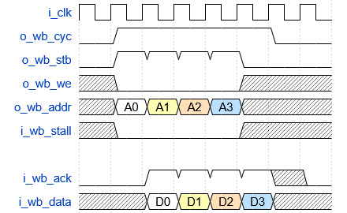
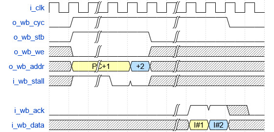

# Lab 3 

Your task is to design, test, and lay out a 2-port wishbone-accessible RAM.
- This ram will be 2 KB
- This ram will take 

To do this, you will use DFFRAM macros.

For a refresher on wishbone, check out this link:
https://zipcpu.com/zipcpu/2017/05/29/simple-wishbone.html

# Part 1

Your basic building block is the DFFRAM module. It gives you a ram with a single read/write port, and interfaces as follows.


Each port of your ram must be accessible in a single cycle, with a waveform as follows. Your module is only driving the stall, ack, and data signals; the rest are driven by your testbench.




In the case that both ports attempt to access the same inner DFFRAM




# Part 2 - Macro Placement

## Defining Power Rails

Macro placement requires specifically named power and ground nets. The default names are `VPWR` and `VGND`.

<table><tr><td> Json </td> <td> Yaml </td></tr><tr><td>

```Json
{
    "VDD_NETS": [
      "VPWR"
  ],
    "GND_NETS": [
        "VGND"
    ]
}
```

</td><td>

```Yaml
---
VDD_NETS:
- VPWR
GND_NETS:
- VGND
```

</td></tr></table>

## Macro Placement

The `MACROS` section defines where macros are placed and with what orientation. It also defines where all the necessary design and timing files are used.

When placing macros, the user has control over:
- Position
  - X and Y coordinates specify the bottom left corner of the macro rectangle.
- Rotation
  - `N`,`S`,`E`, or `W` correspond to the cardinal directions (by default north)
- Mirroring
  - Add an `F`, for example `FN`,`FS`,`FE`, or `FW` to flip/mirror the macro


Generally, macros requires the following files:
- Layout Files
  - gds: layout of all layers
  - lef: layout of pin locations
- Timing Files
  - lib: cell timing
  - spef: wire parasitics (RC)
- Netlist Files
  - nl: verilog netlist
  - pnl: powered netlist

A full list can be found of macro filetypes can be found [here](https://openlane2.readthedocs.io/en/latest/reference/api/config/index.html#openlane.config.Macro)

<table><tr><td> Json </td> <td> Yaml </td></tr><tr><td>

```Json
{
 
   "MACROS": {
      "modulename": {
          "instances": {
          "instance1": {
              "location": ["x coord", "y coord"],
              "orientation": "N,S,E,W, or flipped: FN, FS, etc."
          },
          "instance2": {
              "location": [100, 750],
              "orientation": "FS"
          }
        },
          "gds": [
              "dir::path_to/gds/macro.gds"
          ],
          "lef": [
              "dir::path_to/lef/macro.lef"
          ],
          "spef": {
              "max*": [
                "dir::path_to/spef/max_/macro.max.spef"
              ],
              "min*": [
                "dir::path_to/spef/min_/macro.min.spef"
              ],
              "nom*": [
                "dir::path_to/spef/nom_/macro.nom.spef"
              ]
          },
          "lib": {
              "*": "dir::path_to/lib/max_ss_100C_1v60/macro__max_ss_100C_1v60.lib"
          },
          "nl": [
            "dir::path_to/nl/macro.nl.v"
          ],
          "pnl": [
            "dir::path_to/pnl/macro.pnl.v"
          ]
      }
     }
  
}
```

</td><td>

```Yaml
---
MACROS:
  modulename:
    instances:
      instance1:
        location:
        - x coord
        - y coord
        orientation: 'N,S,E,W, or flipped: FN, FS, etc.'
      instance2:
        location:
        - 100
        - 750
        orientation: FS
    gds:
    - dir::path_to/gds/macro.gds
    lef:
    - dir::path_to/lef/macro.lef
    spef:
      max*:
      - dir::path_to/spef/max_/macro.max.spef
      min*:
      - dir::path_to/spef/min_/macro.min.spef
      nom*:
      - dir::path_to/spef/nom_/macro.nom.spef
    lib:
      "*": dir::path_to/lib/max_ss_100C_1v60/macro__max_ss_100C_1v60.lib
    nl:
    - dir::path_to/nl/macro.nl.v
    pnl:
    - dir::path_to/pnl/macro.pnl.v

```

</td></tr></table>

## Connecting Macro to Power
By default, Openlane has no way to know which pins in your macro are power and ground. To connect your power distribution network to that of the macro, use the `PDN_MACRO_CONNECTIONS` variable. 

<table><tr><td> Json </td> <td> Yaml </td></tr><tr><td>

```Json
{
       "PDN_MACRO_CONNECTIONS": [
        "instance1 VPWR VGND VPWR VGND",
        "instance2 VPWR VGND VPWR VGND"
      ]
}
```

</td><td>

```Yaml
---
PDN_MACRO_CONNECTIONS:
- instance1 VPWR VGND VPWR VGND
- instance2 VPWR VGND VPWR VGND

```

</td></tr></table>


https://openlane2.readthedocs.io/en/latest/usage/caravel/index.html
    

  # Deliverables
  - RTL for 2-Port Wishbone RAM
  - Testbench with tasks for reading/writing each ram port
    - Includes concurrent tests to demonstrate collisions
  - Openlane Configuration for Macro Placement
  - PDF Screenshots of 
